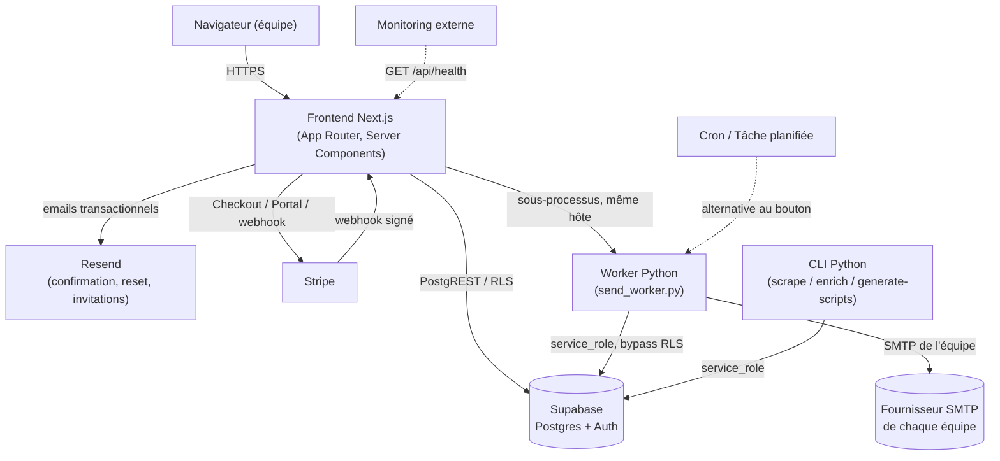
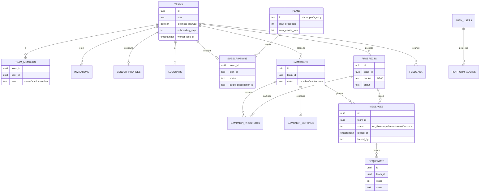
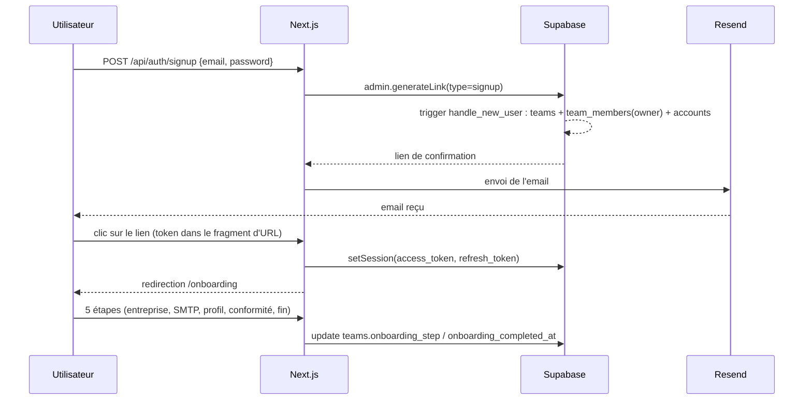
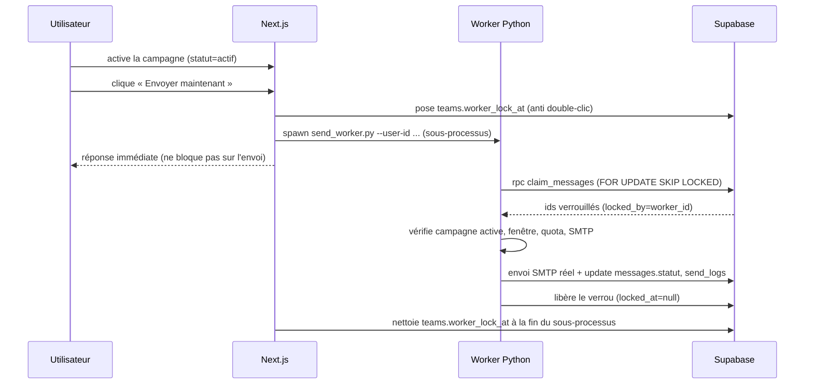
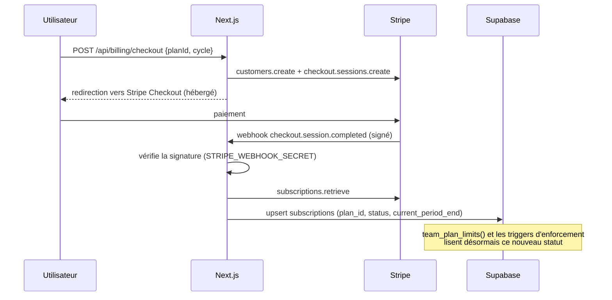
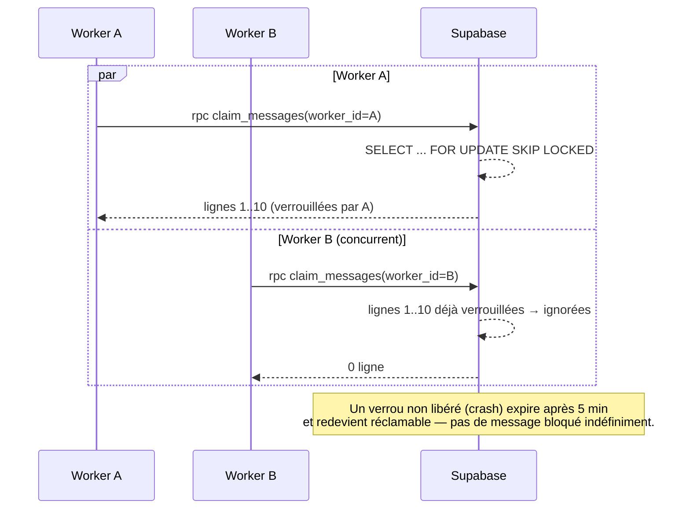

# Architecture — Scrapman

Document technique : schéma système, modèle de données, policies RLS et
flux clés. Pour l'installation, voir [INSTALLATION.md](INSTALLATION.md) ;
pour la mise en production, [DEPLOIEMENT.md](DEPLOIEMENT.md) ; pour le
guide d'utilisation, [NOTICE_UTILISATION.md](NOTICE_UTILISATION.md).

## Schéma système

Le tenant réel est l'**équipe** (`teams`), pas l'utilisateur individuel. Le
frontend ne fait jamais d'envoi SMTP lui-même (sauf déclenchement du worker
via sous-processus) ; toute la collecte (scraping) et tout l'envoi réel
passent par le code Python, en `service_role` (bypass RLS — c'est un
backend de confiance, jamais exposé au navigateur).

## Modèle de données (vue d'ensemble)

`user_id` reste présent sur chaque ligne (créateur) mais **n'est plus la
frontière de sécurité** depuis l'introduction des équipes — c'est `team_id`
qui l'est, vérifié via `is_team_member(team_id)`.

## Policies RLS (résumé)

| Table | Lecture | Écriture | Justification |
| --- | --- | --- | --- |
| `teams` | membre (`is_team_member`) ou super-admin | owner/admin de l'équipe | Pas de policy insert — création uniquement via le trigger `handle_new_user` |
| `team_members` | membre de l'équipe | owner/admin de l'équipe | Un membre ne peut pas se promouvoir lui-même |
| `invitations` | owner/admin de l'équipe | owner/admin (insert/delete) | Acceptation via la fonction `accept_invitation` (security definer), pas une policy directe |
| `prospects`, `campaigns`, `messages`, `sequences`, `call_logs` | membre de l'équipe | membre de l'équipe | Frontière standard team_id |
| `sender_profiles`, `accounts` | membre ou super-admin | membre de l'équipe | 1 ligne par équipe (clé unique sur `team_id`) — partagé par tous les membres |
| `plans` | tout le monde | personne (authenticated) | Grille tarifaire publique, modifiable seulement en SQL direct |
| `subscriptions` | membre ou super-admin | personne (authenticated) | Écrit uniquement par le webhook Stripe (`service_role`) |
| `system_logs` | super-admin uniquement | personne (authenticated) | Pas scopé par équipe — écrit par le worker (`service_role`) |
| `feedback` | super-admin uniquement | l'auteur peut insérer le sien | Support client, pas une donnée d'équipe |
| `platform_admins` | personne (authenticated) | personne (authenticated) | Lu uniquement via `is_platform_admin()` (security definer) — aucune auto-promotion possible |
| `rate_limits` | personne (authenticated) | personne (authenticated) | Écrit uniquement via `verifier_rate_limit()` (security definer, exécutable par `anon`) |

Fonctions `security definer` clés : `is_team_member(team_id)`,
`has_team_role(team_id, roles[])`, `is_platform_admin()`,
`team_plan_limits(team_id)`, `claim_messages`/`claim_followups`,
`verifier_rate_limit`. Toutes bypassent RLS *en interne* pour éviter la
récursion, mais n'exposent que ce qui est strictement nécessaire à l'appelant.

## Flux clés

### Inscription → onboarding

### Activation d'une campagne → envoi

### Webhook Stripe → synchronisation abonnement

### Verrouillage worker (anti double-envoi)

## Décisions architecturales notables

- **Tenant = équipe, pas utilisateur** (Phase A) : permet le partage SMTP/
  prospects/campagnes entre plusieurs membres. `sender_profiles` et
  `accounts` ont une contrainte unique sur `team_id` (1 ligne par équipe).
- **Grandfathering du paywall** : les équipes créées avant la mise en place
  de Stripe (`teams.exempte_paywall`) ne sont jamais bloquées, même sans
  abonnement — évite de casser l'accès des comptes existants au moment du
  déploiement de la facturation.
- **Pas de Redis** : rate limiting et verrouillage du worker sont
  entièrement DB-backed (table + fonction SQL atomique), pour rester sur la
  seule dépendance d'infrastructure du projet (Supabase).
- **Worker en sous-processus, pas en file de tâches** : choix pragmatique
  pour éviter d'introduire une infra de queue (BullMQ/Redis/etc.) alors que
  le worker existant (CLI Python) fonctionnait déjà très bien en
  planification — le bouton « Envoyer maintenant » est une commodité UX,
  pas un changement d'architecture d'envoi.
